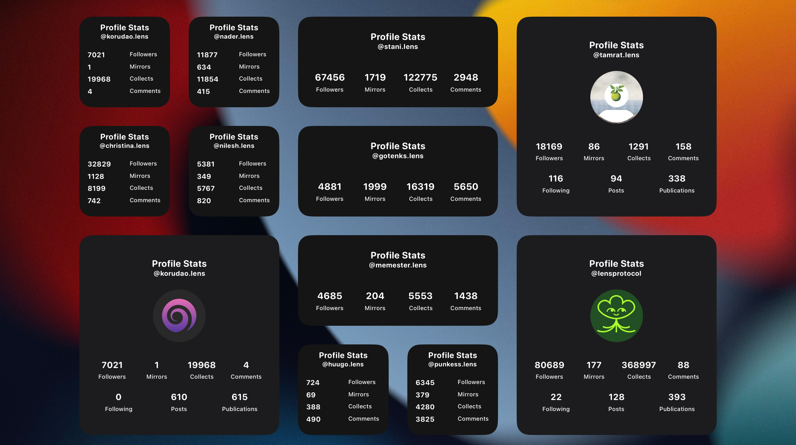

# Lens iOS Widgets 🌿 (under development)
Customizable iOS widgets for viewing lens content and stats

## Instructions 
1. Install [Scriptable](https://apps.apple.com/us/app/scriptable/id1405459188?uo=4) app on your iOS device
2. Open Scriptable app and hit the add button on the top right to add script
3. Copy the contents of `Lens Profile Stats.js` from this repo and paste into Scriptable app
4. Tap on the title of the script (`Untitled Script`) and rename it to `Lens Profile Stats`
5. Go to your home screen and enter the wiggle mode to add widget
6. Search for scriptable and select wheter you want a Small Medium or Large widget
7. Tap the added widget and for the `Script` option select `Lens Profile Stats`
8. For the `Parameter` option type a `lens hadle` you want to view stats of
9. Add as many as widgets as you like with different parameters :)

### Beta Roadmap

- add widgets for post feeds( Profile | Popular | Trending )
- add gallery view widgets for Images and Videos
- add widget for a curated random nft image
- add support for in app deep linking to lens mobile apps ( Orb | Phaver | Buttrfly )

### Contribute

- Feel free to contribute if you see any bugs or want to add improvments.